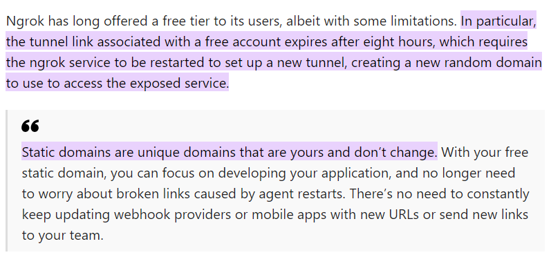

# Text to Image generator using Hugging face, Ngrok and streamlit in Google Colab

This repository contains a Streamlit web application that generates images from text prompts using a pre-trained model from Hugging Face. The application is designed to be run in Google Colab with an Ngrok tunnel for web access.

## Features

- **Text-to-Image Generation**: Use natural language descriptions to generate images.
- **Streamlit Web Interface**: A user-friendly web interface for easy interaction.
- **Google Colab Support**: Instructions for setting up and running the app in Google Colab.
- **Ngrok Integration**: Step-by-step guide to setting up Ngrok for accessing the app over the internet.

[Learn more about ngrok usage and limitation](https://www.infoq.com/news/2023/08/ngrok-free-static-domain/)

## Prerequisites

Before you begin, ensure you have the following:

- A Google account for Google Colab.
- An Ngrok account and an authtoken.

## Usage

* **Start the Streamlit app** in Google Colab using the provided command.
* **Open the Ngrok link** provided in the Colab output to access the web interface.
* **Enter a text prompt** in the Streamlit interface and **click generate** to create an image.

## License

Distributed under the GNU Affero General Public License v3.0. See `LICENSE` for more information.

## Contact

Presenter: [Zartashia Afzal](https://www.linkedin.com/in/zartashiaafzal/)

[Beginner friendly Article guide for this notebook](https://www.linkedin.com/pulse/build-your-ai-image-generator-streamlit-colab-hugging-zartashia-afzal-xiaqf/?trackingId=SzDbsraiQxaUd1QnY6vlnA%3D%3D)
